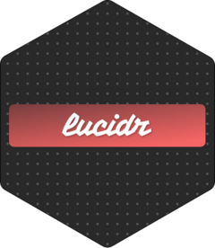

<!-- README.md is generated from README.Rmd. Please edit that file -->

```{r, include = FALSE}
knitr::opts_chunk$set(
  collapse = TRUE,
  comment = "#>",
  fig.path = "man/figures/README-",
  out.width = "100%"
)
```

# lucidr <a href="https://hyperverse-r.github.io/lucidr/"></a>

<!-- badges: start -->

[](https://github.com/hyperverse-r/lucidr/actions/workflows/R-CMD-check.yaml)
[](https://app.codecov.io/gh/hyperverse-r/lucidr)
<!-- badges: end -->

`lucidr` brings the [Lucide](https://lucide.dev) icon library to R. Embed
beautiful and consistent SVG icons inline in any R web application — no
external font, no CDN dependency.

## Installation

```r
pak::pak("hyperverse-r/lucidr")
```

## Usage

```r
library(lucidr)

# Render a single icon
lucide("house")

# Customise size, colour and stroke width
lucide("chevron-right", size = 16, color = "red", stroke_width = 1.5)

# Browse all available icons
lucide_list()
length(lucide_list())  # 1 500+ icons
```

## Example

An interactive icon showcase is included. It displays a grid of Lucide icons
served via [plumber2](https://github.com/thomasp85/plumber2) and
[htmxr](https://github.com/hyperverse-r/htmxr):

```r
source(system.file("examples/icons/run_api.R", package = "lucidr"))
```

Then open <http://127.0.0.1:8080> in your browser.

## Code of Conduct

Please note that the lucidr project is released with a [Contributor Code of Conduct](https://contributor-covenant.org/version/2/1/CODE_OF_CONDUCT.html). By contributing to this project, you agree to abide by its terms
